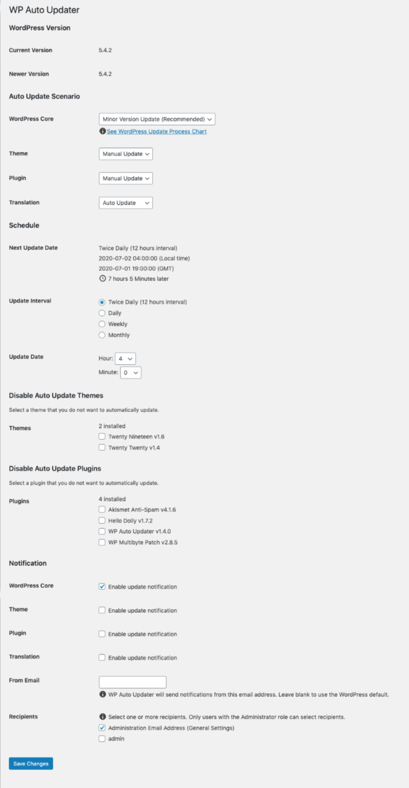
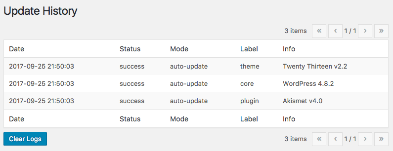

# Introducing WP Auto Updater

This WordPress plugin enables automatic updates of WordPress Core, Themes, Plugins and Translations. Version control of WordPress Core makes automatic update more safely.

## Features

* Automatically update WordPress Core
* Automatically updates Themes, Plugins and Translations
* Set up a schedule automatic updates
* Disable automatic updating of each Themes and Plugins
* Record update history

**Important**: before updating, please back up your database and files.

## Auto Update Scenario

First of all, we will make an **Auto Update Scenario** which decide the policy of WordPress automatic updates.

You can choose from the following five automatic updates of WordPress Core.

* Minor Version Update (Recommended)
* Major Version Update
* Minor Only Version Update
* Previous Generation Version Update
* Manual Update

### Minor Version Update (Recommended)

**Minor Version Update (Recommended)** enable minor updates. Minor updates is default behavior in WordPress for security updates. The transition of the version number is as follows: update from 4.8 to 4.8.1, 4.8.2 ...

### Major Version Update

**Major Version Update** enable major updates. The transition of the version number is as follows: update from 4.7 to 4.8, 4.9 ...

### Minor Only Version Update

**Minor Only Version Update** enable major updates and minor updates **except version x.y.0**.

Update the WordPress Core version (eg. x.y.1 or later) with security fixed. Not automatically update the latest major version of x.y.0. The transition of the version number is as follows: update from 4.7.z to 4.8.z, 4.9.z ... skiped 4.7.0, 4.8.0, 4.9.0 ...

### Previous Generation Version Update

**Previous Generation Version Update** enable major updates and minor updates **except the latest major version**.

With the installed WordPress Core version as 4.6.z. If the latest WordPress Core version released to 4.8.0, automatically update it to version 4.7.z. It will be always automatically updated to the previous generation WordPress Core version with probably security fixed.

### Manual Update

**Manual Update** disable automatic updates. You update WordPress Core manually on the Dashboard Updates Screen.

**Automatic updates** and **manual updates** are available for themes, plugins and Translations.
It is also possible to disable automatic updating of each Themes and Plugins.

## Scheduled automatic updates

Next we will set up a schedule for automatic updates.
The update interval can be selected from the following four.

* Twice Daily (12 hours interval)
* Daily
* Weekly
* Monthly

You can also set the day, the day of the week, the hour and the minute of the Update Date.

At the time of automatic update, Automatically updates WordPress Core, Themes, Plugins and Translations to be updated.

## Installation

1. Download and unzip files. Or install **WP Auto Updater** using the WordPress plugin installer. In that case, skip 2.
2. Upload **wp-auto-updater** to the "/wp-content/plugins/" directory.
3. Activate the plugin through the ' Plugins' menu in WordPress.
4. Configure settings through the **Dashboard > Auto Updater** menu in WordPress.
5. Have fun!

## How do I use it ?

1. Make an Auto Update Scenario
2. Set up a schedule automatic updates
3. Disable Auto Update Themes and Plugins if necessary
4. Automatically updates WordPress Core, Themes, Plugins and Translations to be updated at the time of automatic update
5. The update history will be recorded

## Screenshot

### Auto Update settings

### Auto Update History

## Test Matrix

For operation compatibility between PHP version and WordPress version, see below [Travis CI](https://travis-ci.org/thingsym/wp-auto-updater)

## Resources

* [Updating WordPress - WordPress Codex](https://codex.wordpress.org/Updating_WordPress)
* [Configuring Automatic Background Updates - WordPress Codex](https://codex.wordpress.org/Configuring_Automatic_Background_Updates)

## Contributing

### Patches and Bug Fixes

Small patches and bug reports can be submitted a issue tracker in Github. Forking on Github is another good way. You can send a pull request.

* [wp-auto-updater - GitHub](https://github.com/thingsym/wp-auto-updater)
* [WP Auto Updater - WordPress Plugin](https://wordpress.org/plugins/wp-auto-updater/)

## Changelog

* Version 1.0.1
	* fix readme
	* add PHPDoc comments
* Version 1.0.0
	* initial release
